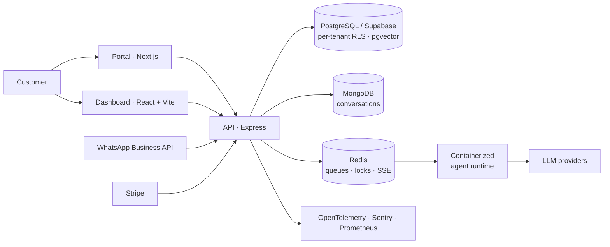

# LuckAgents: a multi-tenant SaaS for AI agents on WhatsApp

**Role:** design and implementation, solo · **Period:** 2024 to present (called Luck AI until 2025) · **Code:** private

Businesses connect their own WhatsApp number, and AI agents answer their customers, book appointments and take payments. The code is a pnpm and Turborepo monorepo with 10 workspaces: a public Next.js portal, a React/Vite dashboard, an Express API with 42 route modules and an agent runtime that runs in containers, on top of PostgreSQL/Supabase, MongoDB and Redis.

## Decisions behind the system

### Tenant isolation lives in the database

If a multi-tenant app filters by `tenantId` in application code, every query is a chance to leak data. I put the boundary in PostgreSQL instead: 31 Row Level Security policies, 23 direct and 8 going through a `current_tenant_id()` function. They require an **active** membership and still let the service role run system tasks.

I learned this from an audit, not an incident. Members in the `suspended` and `invited` states could still read data directly. Every endpoint was written correctly; the hole was in the policies. Since then, each permission change ships with an RLS regression test, because you can't see an isolation bug by reading the controller.

> I published the pattern as a small, runnable repo: **[multi-tenant-rls](https://github.com/joshua-angulo/multi-tenant-rls)**, with 16 tests (most of them negative) and a mutation check that shows the tests catch a broken policy.

### Payments and messages happen once

Stripe and WhatsApp Business can deliver the same webhook more than once. To avoid double charges and duplicate messages, every external effect runs under an idempotency key, and sections that can't overlap across instances take a distributed lock in Redis. Stripe webhooks are signature-checked and saved as a durable receipt before the API responds, and payments are reconciled against each provider. When the system isn't sure, it doesn't act: skipping an action is easier to fix than doing it twice.

### Agents that hand off

Agents call tools to book appointments and charge customers, answer from each business's own documents through RAG on pgvector, and transcribe voice notes. When the model fails or a request is out of scope, the conversation goes to a person. Each tenant's AI budget is reserved before every paid model call, so one customer can't run up costs for everyone else.

### SSE for streaming agent replies

An agent reply only flows from server to client. Server-Sent Events reconnect on their own, work through corporate proxies and carry the same traces as the rest of the API. A WebSocket would have added a two-way channel I didn't need and one more thing to keep running.

### Secrets stay out of the repository

Configuration lives in an external secrets manager, and git only holds templates without values. The pre-commit hook runs a secret scan that blocks the commit whenever it can't verify it. Rejecting a clean commit now and then costs far less than rotating leaked credentials.

### Observability from the start

I added OpenTelemetry traces, Sentry errors and Prometheus metrics together with each feature. Adding them at the end means reworking the edges of the system right when people start depending on it.

## Modernization audit

In July 2026 I audited the whole monorepo. Where it started and where it ended:

| Area | Before | After |
|---|---|---|
| Supply chain | 155 vulnerable production dependency paths: 4 critical, 73 high, 66 moderate, 12 low | 0 known advisories |
| Tenant isolation | `suspended` and `invited` members could read directly under 31 policies | forward migration: all 31 require an active membership |
| Authentication | a legacy OAuth flow next to SSO that trusted the identity the client sent | legacy OAuth removed |
| CI/CD | no static security analysis | GitHub Actions with CodeQL and dependency review |

Local validation at the end: **619** API tests passing (0 failures, 1 skipped on purpose), **371/371** dashboard unit and UI tests, **76/76** end-to-end tests in Chromium and Firefox, and a 10/10 global build. 1,066 automated tests in total.

## The verdict, and why I'm publishing it

**The audit concluded NO-GO for production.** Everything passed locally, and the system still wasn't ready to deploy. Some external checks were still open (connectivity to the managed database cluster, and the API and Redis on the hosting provider), and no local test could cover them.

I'm sharing this because the gap between "my tests pass" and "this can run in production" took me the longest to learn. A system that charges money and talks to real customers goes live once those external checks pass in the real environment and there's a recovery path that has actually been tested. A green CI run alone doesn't get it there.

## What I would do differently

- Write the RLS policies before the endpoints, each one with a negative test: a query that should fail, and does.
- Define the environment variables as a checked contract from day one, before three apps drift apart.
- Write down what "ready for production" means at the start, including the external checks. Deciding it at the end means deciding it under pressure.

---

**En español.** LuckAgents es un SaaS multi-tenant de agentes de IA para WhatsApp: un monorepo pnpm/Turborepo con 10 workspaces, una API en Express, un dashboard en React/Vite, un portal en Next.js y un runtime de agentes en contenedores, sobre PostgreSQL/Supabase, MongoDB y Redis. El aislamiento entre clientes vive en la base de datos (31 políticas RLS), los pagos y mensajes externos son idempotentes, y los agentes usan herramientas y RAG sobre pgvector y pasan el caso a una persona cuando hace falta. En julio de 2026 una auditoría bajó de 155 a 0 las rutas vulnerables en dependencias y dejó 1,066 pruebas en verde. Aun así concluyó que no estaba listo para producción, porque faltaban verificaciones externas. Por eso escribí este caso.
