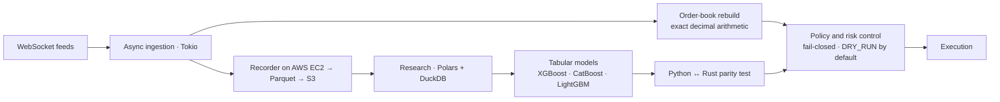

# A real-time data and ML platform

**Role:** design and implementation, solo · **Period:** 2026 to present · **Code:** private

In short: I built a system that records live crypto-market data on AWS, trains machine-learning models on it and runs those models in real time from a program written in Rust. The rest of this page explains how it's put together and why.

The platform has two halves that have to agree with each other. One is an async Rust runtime that reads real-time feeds and makes decisions under latency limits. The other is a Python research stack that trains and validates the models the runtime executes. As of July 2026 the repository had 534 commits, 1,309 Rust test functions and 535 Python test files.

This note is about how the system is built. It leaves out the venue, the instruments, the thresholds and every result.

## Decisions behind the system

### Money is never an `f64`

Every order and execution path uses exact decimal arithmetic (`rust_decimal`). Binary floating point only shows up where rounding can't matter, such as aggregate risk limits. It feels like an overly strict rule until a one-ulp difference crosses a price threshold and leaves a position in a state no test ever covered.

### Python and Rust have to give the same score

Models are trained in Python and run in Rust. If the two disagree, whether from a different feature order, a rounding step or a type mismatch, the historical validation stops describing what runs live. So a contract test scores the same golden vectors in both languages and fails the pipeline if they differ. Eight contract tests and the quality gate cover that boundary.

### Evaluation data gets used once

Before I open any evaluation data, I write down the judge: which days, which frozen model hashes and which bars a model has to clear. Once I've looked at a day's results, that day moves to the training set for good, and the log records whether each day is still sealed or already used.

Without this rule, a backtest ends up measuring how many times I peeked at the test data. Diagnostics on training days are unlimited, but a model is only accepted on a forward window I registered in advance. Validation is walk-forward, with purging at every train/test boundary so information doesn't leak across time.

### Going live in stages

A new model reaches the engine in steps. First it runs in shadow mode, scoring live data without acting. Then it runs as a small canary. At both stages I compare drift and latency with what the backtest predicted, and if live behavior differs from research, I find out why before giving the model more room.

### Every control has a test that makes it fail

A check that has never failed tells you nothing, because it might be switched off. So each integrity check comes with a test that injects bad data and confirms the system stops. The runtime works the same way: it starts in simulation mode, and going live needs the recorder running, the order book in sync and a separate confirmation. The safe state is the default, so nobody has to remember to turn it on.

### Every result points to a commit

Each verdict goes into an append-only log, and its evidence is committed in machine-readable form and linked by SHA-256. A result that only exists in an ignored folder doesn't count. In practice this means I can reopen any claim in the project at the exact commit that produced it.

### Explain a bad segment before cutting it

When part of the data looks bad, it's tempting to drop it. Here a segment only leaves the training set after I've ruled out fees, API behavior and the data source as causes, checked whether the effect transfers in both directions and looked for a dose-response pattern. One bad aggregate number isn't enough, because that's an easy way to delete the signal you didn't want to see.

## Outside of markets

The same constraints show up in any system that handles money or critical decisions: amounts that can't be rounded, decisions that need an audit trail, retries that must not repeat an effect, safety checks that have to be tested, and a clear line between what was measured and what was assumed. The difference here is that mistakes show up quickly, because they cost money.

---

**En español.** Plataforma de investigación y ejecución cuantitativa para mercados electrónicos. Un runtime asíncrono en Rust (Tokio) lee feeds WebSocket en tiempo real, reconstruye libros de órdenes con aritmética decimal exacta y decide con límites de latencia. La investigación en Python (Parquet, Polars, DuckDB y modelos de gradient boosting) trabaja con datos grabados en AWS. Python y Rust tienen que dar el mismo puntaje, y una prueba de contrato lo verifica. Los datos de evaluación se usan una sola vez, con un juez registrado de antemano y validación walk-forward purgada. Los modelos pasan por shadow y canary antes de crecer. No incluyo el mercado, los instrumentos, los umbrales ni los resultados.
